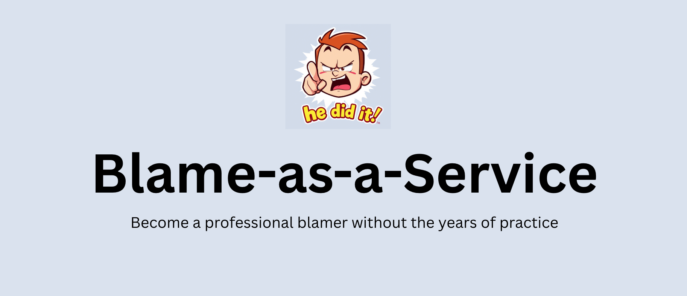

# 🎯 Blame-as-a-Service (BaaS) v2.0



<div align="center">

### Because it's NEVER your fault. Ever.

[](https://blame-as-a-service.onrender.com)
[](https://www.python.org/)
[](https://fastapi.tiangolo.com/)
[](LICENSE)

**100+ Excuses** • **10 Categories** • **ASCII Art** • **Severity Ratings** • **Interactive Demo**

[Live Demo](https://blame-as-a-service.onrender.com/demo) • [API Docs](https://blame-as-a-service.onrender.com/docs) • [Report Bug](https://github.com/sbmagar13/blame-as-a-service/issues)

</div>

---

## 🌟 What's New in v2.0

Tired of taking responsibility for your own mistakes? Need a scapegoat that isn't "the dog ate my homework" or "my grandmother died" (for the fifth time this year)? Our **completely redesigned** API now returns creative, categorized, and hilariously implausible blame excuses with **epic visual displays**!

### ✨ New Features

- 🎨 **ASCII Art Display** - 4 dramatic visualization styles (Box, Banner, Simple, Dramatic)
- 📊 **Severity Levels** - From "Minor Oopsie" 🟢 to "Catastrophic Disaster" 🔴
- 🗂️ **10 Categories** - Cosmic, Technical, Management, AI/ML, Cloud, Security, and more
- 💎 **Rich Details** - Quality scores, believability ratings, and visual elements
- 🎭 **100+ Excuses** - Expanded from 50 to 100+ carefully crafted excuses
- 🎰 **Blame Roulette** - Get multiple excuses at once
- 🌐 **Interactive Demo** - Gorgeous web UI with animations and confetti

Built by developers who definitely didn't break the build, for developers who definitely won't.

> "I would've written a better quote, but my keyboard doesn't have the right keys for profound thoughts." - Blame Scientists

---

## 🚀 Quick Start

### Try It Now!

```bash
# Get a random blame excuse
curl https://blame-as-a-service.onrender.com/blame

# Get blame as epic ASCII art
curl https://blame-as-a-service.onrender.com/blame/ascii?style=dramatic

# Get blame from a specific category
curl https://blame-as-a-service.onrender.com/blame/category/cosmic

# Get multiple blames for extra coverage
curl https://blame-as-a-service.onrender.com/blame/multiple?count=5
```

---

## 📖 API Endpoints

**Base URL:** `https://blame-as-a-service.onrender.com`
**Rate Limit:** 120 requests/minute/IP (We know you mess up a lot, but come on)

### Core Endpoints

| Endpoint | Description | Example |
|----------|-------------|---------|
| `GET /blame` | Random blame excuse | `{"blame": "...", "category": "technical", "severity": "moderate"}` |
| `GET /blame/rich` | Excuse with quality scores & details | Includes believability, quality scores, severity info |
| `GET /blame/ascii` | Epic ASCII art format | 4 styles: `box`, `banner`, `simple`, `dramatic` |
| `GET /blame/category/{category}` | Blame from specific category | Categories: cosmic, technical, management, etc. |
| `GET /blame/severity/{severity}` | Blame by severity level | Levels: minor, moderate, catastrophic |
| `GET /blame/multiple` | Multiple excuses at once | Query param: `?count=3` (max 10) |

### Utility Endpoints

| Endpoint | Description |
|----------|-------------|
| `GET /categories` | List all available categories |
| `GET /severity-info` | Information about severity levels |
| `GET /stats` | API statistics and excuse breakdown |
| `GET /health` | Health check endpoint |

### 📋 Example Responses

**Simple Blame (`/blame`)**
```json
{
  "blame": "The developer was coding during a full moon while Mercury was in retrograde during a solar eclipse on Thursday the 13th",
  "category": "cosmic",
  "severity": "catastrophic"
}
```

**Rich Blame (`/blame/rich`)**
```json
{
  "blame": "Our AI pair programmer started hallucinating and insisted that indentation is optional in Python",
  "category": "ai_modern",
  "severity": {
    "level": "catastrophic",
    "emoji": "🔴",
    "name": "CATASTROPHIC DISASTER",
    "description": "Career-defining moment. Hope you have a good lawyer.",
    "numeric": 3,
    "bar": "▓▓▓▓▓▓▓▓▓▓ 100% 🔥💀🔥"
  },
  "quality_score": 9,
  "believability": 7,
  "disclaimer": "This excuse is certified 100% not your fault™"
}
```

**ASCII Art (`/blame/ascii?style=banner`)**
```
▀▀▀▀▀▀▀▀▀▀▀▀▀▀▀▀▀▀▀▀▀▀▀▀▀▀▀▀▀▀▀▀▀▀▀▀▀▀▀▀▀▀▀▀▀▀▀▀▀▀▀
                🚨 OFFICIAL BLAME CERTIFICATE 🚨
▀▀▀▀▀▀▀▀▀▀▀▀▀▀▀▀▀▀▀▀▀▀▀▀▀▀▀▀▀▀▀▀▀▀▀▀▀▀▀▀▀▀▀▀▀▀▀▀▀▀▀

  The intern thought 'rm -rf /' was a cleaning command

  ━━━━━━━━━━━━━━━━━━━━━━━━━━━━━━━━━━━━━━━━━━━━━━━
  Severity: 🔴 CATASTROPHIC DISASTER
  Category: TEAM
  Excuse Quality: 8/10 ⭐
  ━━━━━━━━━━━━━━━━━━━━━━━━━━━━━━━━━━━━━━━━━━━━━━━

           This excuse has been officially certified by
                   🏢 Blame-as-a-Service Inc. 🏢
▄▄▄▄▄▄▄▄▄▄▄▄▄▄▄▄▄▄▄▄▄▄▄▄▄▄▄▄▄▄▄▄▄▄▄▄▄▄▄▄▄▄▄▄▄▄▄▄▄▄▄
```

---

## 📂 Categories

Choose your excuse flavor:

- 🌌 **cosmic** - Blame the universe (Mercury retrograde, solar eclipses, cosmic rays)
- 💻 **technical** - Classic tech failures (Stack Overflow, database naps, race conditions)
- 👔 **management** - Blame leadership decisions (pivots, CEO dreams, TED talks)
- 👥 **team** - Blame your colleagues (interns, breakups, coffee breaks)
- 🌍 **environmental** - Blame your surroundings (office cats, thermostat, feng shui)
- 📜 **legacy** - Blame ancient code (COBOL scripts, time bombs from 2008)
- 👤 **user** - Blame the users (Bobby Tables, refresh enthusiasts)
- 🤖 **ai_modern** - Blame AI/ML (hallucinating models, sentient deployments)
- ☁️ **cloud** - Blame the cloud (AWS surprises, serverless rebellion)
- 🔐 **security** - Blame security fails (password123, ROT13 encryption)

---

## 🛠️ Self-Hosting

Want to run it yourself? It's lightweight, simple, and gives you someone else to blame when it inevitably crashes!

### Quick Start

```bash
# 1. Clone the repository
git clone https://github.com/sbmagar13/blame-as-a-service.git
cd blame-as-a-service

# 2. Install dependencies
pip install -r requirements.txt

# 3. Run the server
python blame_app.py
```

The API will be live at:
- **API**: http://localhost:3000/blame
- **Interactive Demo**: http://localhost:3000/demo
- **API Docs**: http://localhost:3000/docs

### Custom Port

```bash
PORT=5000 python blame_app.py
```

### Project Structure

```
blame-as-a-service/
├── blame_app.py          # FastAPI application with all endpoints
├── blame_data.py         # 100+ excuses organized by category & severity
├── blame_visualizer.py   # ASCII art generators and formatters
├── static/
│   └── demo.html        # Interactive web demo
├── requirements.txt      # Python dependencies
└── README.md            # You are here
```

---

## 🎨 Use Cases

Perfect for:
- ✅ Standup meetings when you haven't made progress
- ✅ Explaining production outages at 3 AM
- ✅ Code review comments that need... creativity
- ✅ Slack bot entertainment
- ✅ Git commit messages (we don't judge)
- ✅ When your manager asks "why?"
- ✅ Fun CLI tools and integrations
- ✅ Learning FastAPI with a hilarious example

---

## 🤝 Contributing

Found a hilarious excuse we missed? Want to add a new category? PRs are welcome!

1. Fork the repository
2. Add your excuses to `blame_data.py`
3. Test with `python blame_app.py`
4. Submit a PR with your best excuse as the description

**Bonus points if your PR message blames someone else for why you're contributing.**

---

## 📊 Stats

```python
Total Excuses: 100+
Categories: 10
Severity Levels: 3
ASCII Art Styles: 4
Lines of Blame: ∞
Responsibility Taken: 0%
```

---

## 🌟 Show Your Support

If this project helped you avoid accountability, consider:
- ⭐ Starring the repo (blame GitHub's star system if you forget)
- 🐛 Reporting issues (blame the bugs, not us)
- 💬 Sharing with your team (blame them for laughing too hard)
- 🔀 Forking and customizing (blame your coworkers by name!)

---

## 📄 License

MIT — Do whatever you want with this code, just don't blame yourself when you should be blaming others.

When in doubt, remember our company motto:
> "It wasn't me, it was probably Dave from DevOps."

The intern is always a safe choice too. Or Mercury being in retrograde. Or cosmic rays. Or that weird bug that only happens on Tuesdays. Or the AI that wrote this code. Or the product manager who approved it. Or the coffee machine. Or...

---

## 📞 Support

- 📚 [API Documentation](https://blame-as-a-service.onrender.com/docs)
- 🎨 [Live Demo](https://blame-as-a-service.onrender.com/demo)
- 🐛 [Report Issues](https://github.com/sbmagar13/blame-as-a-service/issues)
- 💬 [Discussions](https://github.com/sbmagar13/blame-as-a-service/discussions)

---

<div align="center">

**Made with 💀 by developers who definitely didn't break production**

*"I didn't write this README, my cat did while Mercury was in retrograde during a solar eclipse on a Thursday."*

[⬆ Back to Top](#-blame-as-a-service-baas-v20)

</div>
