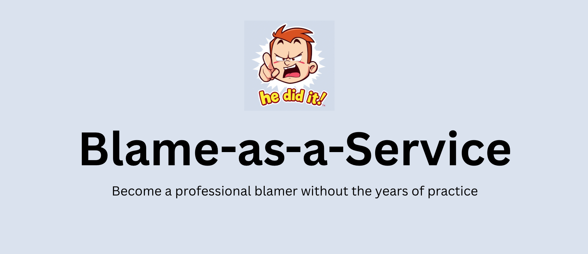

# 🎯 Blame-as-a-Service

> Enterprise-grade accountability deflection. Now with AI.

<div align="center">



### Whatever broke, it wasn't you.

[](https://baas.budhathokisagar.com.np)
[](#)
[](#)
[](LICENSE)

**Contextual AI Blames** • **100+ Pre-Generated Excuses** • **Shareable Reports** • **OG Image Previews**

[Generate a blame →](https://baas.budhathokisagar.com.np/contextual) • [API Docs](https://baas.budhathokisagar.com.np/docs) • [GitHub Issues](https://github.com/sbmagar13/blame-as-a-service/issues) (please blame someone in the title)

</div>

---

## ✨ What's new

The latest release introduces **Contextual Blame Generation™** — paste any technical artifact (stack trace, commit message, ticket title, SQL incident) and our model identifies a plausible-adjacent scapegoat tailored to your specific incident. Each blame gets a permanent share URL with rich link previews, ready for Slack, X, or your next post-mortem.

- 🤖 **Contextual AI blames** powered by GPT-OSS 120B via Groq
- 🔗 **Shareable reports** at `/b/{id}` with OG image cards
- 🔁 **Regenerate flow** when the first blame doesn't quite hit
- 🎨 **Premium parody landing page** at `/contextual`
- 🗂️ **Legacy random-blame API** preserved at `/blame` (now with friends)
- 📊 **Severity ratings** that mean nothing
- 🎰 **Blame roulette** for when one excuse isn't enough

---

## 🚀 Quick start

### Generate a contextual blame

```bash
curl -X POST https://baas.budhathokisagar.com.np/blame/contextual \
  -H "Content-Type: application/json" \
  -d '{"input": "git push --force origin main"}'
```

Response:

```json
{
  "id": "a3f7b21c",
  "blame": "The force-push was the inevitable result of the third-party vendor everyone forgot was still in the loop",
  "cached": false,
  "model": "openai/gpt-oss-120b"
}
```

Open the share page at `https://baas.budhathokisagar.com.np/b/a3f7b21c`. Paste the URL into Slack or X. Watch the unfurl. Watch the laughs. Watch your career arc upward.

### Or use the legacy random API

```bash
curl https://baas.budhathokisagar.com.np/blame
curl https://baas.budhathokisagar.com.np/blame/ascii?style=dramatic
curl https://baas.budhathokisagar.com.np/blame/category/cosmic
```

---

## 📖 API reference

**Base URL:** `https://baas.budhathokisagar.com.np`

### Contextual (AI)

| Endpoint | Description | Rate limit |
|----------|-------------|------------|
| `POST /blame/contextual` | Generate a contextual blame from input. Body: `{"input": "...", "regenerate": false}` | 20/hour/IP |
| `GET /blame/contextual/{id}` | Retrieve a generated blame by ID | — |
| `GET /b/{id}` | Public share page with OG image | 60/hour/IP |
| `GET /static/og/{id}.png` | The OG image for a blame | — |

### Legacy (random)

| Endpoint | Description |
|----------|-------------|
| `GET /blame` | Random blame excuse with category & severity |
| `GET /blame/rich` | Excuse with quality scores & detailed severity info |
| `GET /blame/ascii` | ASCII art format (`?style=box\|banner\|simple\|dramatic`) |
| `GET /blame/category/{category}` | Blame from specific category |
| `GET /blame/severity/{severity}` | Blame by severity (minor, moderate, catastrophic) |
| `GET /blame/multiple` | Multiple excuses (`?count=3`, max 10) |
| `GET /categories` | List all categories |
| `GET /severity-info` | Severity level details |
| `GET /stats` | API statistics |
| `GET /health` | Health check |

Default rate limit on legacy endpoints: 120/minute/IP.

---

## 📂 Categories (legacy random API)

| Category | Description |
|----------|-------------|
| 🌌 `cosmic` | Mercury retrograde, solar eclipses, cosmic rays |
| 💻 `technical` | Stack Overflow, database naps, race conditions |
| 👔 `management` | Pivots, CEO dreams, TED talks |
| 👥 `team` | Interns, breakups, coffee breaks |
| 🌍 `environmental` | Office cats, thermostat, feng shui |
| 📜 `legacy` | COBOL scripts, time bombs from 2008 |
| 👤 `user` | Bobby Tables, refresh enthusiasts |
| 🤖 `ai_modern` | Hallucinating models, sentient deployments |
| ☁️ `cloud` | AWS surprises, serverless rebellion |
| 🔐 `security` | password123, ROT13 encryption |

The contextual AI endpoint generates fresh scapegoats per request — no fixed categories.

---

## 🛠️ Self-hosting

```bash
git clone https://github.com/sbmagar13/blame-as-a-service.git
cd blame-as-a-service

# install dependencies
pip install -r requirements.txt

# get a free Groq API key from https://console.groq.com (no card required)
echo "GROQ_API_KEY=gsk_..." > .env

# download fonts for OG image rendering (one-time, optional — falls back if missing)
mkdir -p static/fonts
curl -L -o static/fonts/JetBrainsMono-Bold.ttf \
  "https://github.com/JetBrains/JetBrainsMono/raw/master/fonts/ttf/JetBrainsMono-Bold.ttf"
curl -L -o static/fonts/JetBrainsMono-Regular.ttf \
  "https://github.com/JetBrains/JetBrainsMono/raw/master/fonts/ttf/JetBrainsMono-Regular.ttf"

# run
python blame_app.py
```

**Endpoints (local):**

- `http://localhost:3000/` — landing
- `http://localhost:3000/contextual` — contextual blame UI
- `http://localhost:3000/demo` — legacy demo
- `http://localhost:3000/docs` — API docs

### Project structure

```
blame-as-a-service/
├── blame_app.py          # FastAPI app, legacy random-blame endpoints
├── blame_data.py         # 100+ static excuses by category & severity
├── blame_visualizer.py   # ASCII art renderers for legacy endpoints
├── contextual.py         # Contextual AI blame router (Groq + SQLite)
├── og_image.py           # 1200x630 share-card renderer (Pillow)
├── static/
│   ├── contextual.html   # Premium parody landing page
│   ├── demo.html         # Legacy demo
│   ├── fonts/            # JetBrains Mono (download separately)
│   └── og/               # Generated share images (gitignored)
├── blames.db             # SQLite cache (gitignored)
└── requirements.txt
```

### Environment variables

| Variable | Required | Description |
|----------|----------|-------------|
| `GROQ_API_KEY` | Yes (for contextual) | Groq API key. Free tier covers 14.4K requests/day on most models. |
| `PORT` | No | Defaults to 3000. |

The legacy random-blame endpoints work without `GROQ_API_KEY`. Only `/blame/contextual` requires it.

### Switching models

Change `GROQ_MODEL` in `contextual.py`. Tested on the Groq free tier:

| Model | Quality | Speed | Notes |
|-------|---------|-------|-------|
| `openai/gpt-oss-120b` | Excellent | Slower | Default. Best instruction following. |
| `llama-3.3-70b-versatile` | Very good | Medium | Solid fallback. |
| `llama-3.1-8b-instant` | OK | Very fast | Hallucinates tokens not in input. |

---

## 🤝 Contributing

We accept pull requests, blame, and excuses.

1. Fork the repository
2. Add excuses to `blame_data.py`, refine the system prompt in `contextual.py`, or improve the parody copy
3. Test with `python blame_app.py`
4. Submit a PR (please blame someone in the title — it sets the tone)

---

## 🔒 Security & compliance

| Standard | Status |
|----------|--------|
| SOC 2 | In spirit |
| ISO 27001 | Spiritually |
| HIPAA | We wish |
| GDPR | Don't ask |
| FedRAMP | Vibes only |

For actual concerns, open an issue.

---

## 📄 License

MIT — Do whatever you want, just don't blame yourself.

> "It wasn't me, it was probably Dave from DevOps."

---

<div align="center">

**Built by developers who definitely didn't break production**

[Generate a blame →](https://baas.budhathokisagar.com.np/contextual) • [API Docs](https://baas.budhathokisagar.com.np/docs) • [Author](https://blog.budhathokisagar.com.np)

</div>
